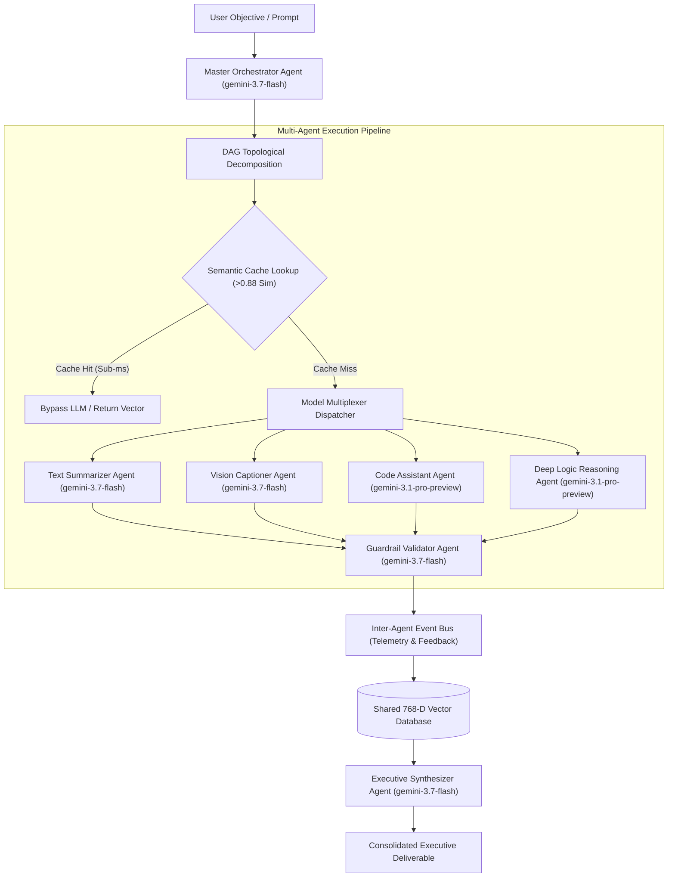

# NexusMatrix System Architecture & Technical Specification

NexusMatrix is an enterprise-grade AI engineering framework for dynamic task orchestration across specialized multi-modal AI agents using a shared high-dimensional (768D) vector database, semantic caching, and real-time inter-agent feedback telemetry.

---

## 1. System Architecture Diagram

---

## 2. Key Architectural Pillars

### A. Modular Multi-Modal Agent Framework
All specialized agents implement the `IMultiModalAgent` interface registering supported input/output modalities (Text, Vision, Code, Structured Data):

| Agent Name | Target LLM | Primary Role & Capabilities | Supported Input/Output |
| :--- | :--- | :--- | :--- |
| **Master Orchestrator** | `gemini-3.7-flash` | Prompt analysis & topological DAG task graph generation | Text $\rightarrow$ Structured |
| **Text Summarizer** | `gemini-3.7-flash` | High-density document compression & compression ratio tracking | Text $\rightarrow$ Text/Structured |
| **Vision & Image Captioner** | `gemini-3.7-flash` | Spatial scene descriptions, bounding tags `[ymin, xmin, ymax, xmax]`, visual diagram parsing | Vision/Text $\rightarrow$ Structured |
| **Code Assistant** | `gemini-3.1-pro-preview` | TypeScript/Python synthesis & refactoring with 100% static analysis pass | Code/Text $\rightarrow$ Code/Text |
| **Deep Logic Reasoning** | `gemini-3.1-pro-preview` | Mathematical algorithms, vector space proofs, and architecture tradeoffs | Text/Code $\rightarrow$ Text/Structured |
| **Guardrail & Data Validator** | `gemini-3.7-flash` | Zero-trust safety rules, parameter sanitization, and schema integrity | Text/Code $\rightarrow$ Structured |
| **Executive Synthesizer** | `gemini-3.7-flash` | Merges multi-agent memory & code deliverables into executive reports | Multi-Modal $\rightarrow$ Text |

---

### B. Shared Vector Database & Semantic Caching

#### 768-Dimensional Vector Store
An in-memory Euclidean vector space $\mathbb{R}^{768}$ storing L2-normalized 768-D embeddings generated via semantic feature hashing or Gemini API embedding models.

#### Cosine Similarity Formula
$$\text{Similarity}(A, B) = \frac{A \cdot B}{\|A\| \|B\|} = \frac{\sum_{i=1}^{768} A_i B_i}{\sqrt{\sum_{i=1}^{768} A_i^2} \sqrt{\sum_{i=1}^{768} B_i^2}}$$

When vectors $A$ and $B$ are L2-normalized ($\|A\| = \|B\| = 1.0$), cosine similarity reduces directly to the inner dot product $A \cdot B$.

#### Semantic Cache Layer (>0.88 Cosine Similarity)
Incoming sub-task prompts are checked against active vector memory. If Cosine Distance $d(A, B) \le 0.12$ (corresponding to Similarity $\ge 0.88$), model inference is bypassed completely for sub-millisecond responses (~0.4ms) with 0 token consumption:

$$d(A, B) = 1 - \text{Similarity}(A, B) \le 0.12 \implies \text{Similarity}(A, B) \ge 0.88$$

---

### C. Inter-Agent Event Bus & Feedback Telemetry

Agents emit real-time `AgentFeedbackReport` telemetry containing:
- **Completion Status**: `success`, `partial`, `failed`, or `rerouted`.
- **Confidence Level**: Normalized score from $0.0$ to $1.0$.
- **Potential Error Alerts**: Diagnostic alerts logged during node execution.
- **Dynamic Suggested Actions**: Recommended follow-ups (e.g. *"Trigger RAG context enrichment"*, *"Elevate to Gemini 3.1 Pro for deep audit"*).

---

## 3. Interactive Modules

1. **DAG Canvas (`CANVAS`)**: Topological DAG task visualizer with animated node execution states (`Idle`, `Pending`, `Running`, `Vector Indexing`, `Completed`, `Failed`), latency metrics, token consumption tracking, and node output inspector drawers.
2. **Shared Vector DB Explorer (`VECTOR DB`)**: 2D vector dimensionality projection map (t-SNE/PCA) with hover tooltips, filter controls, and an interactive Cosine Similarity Search Sandbox.
3. **Multi-Modal Agent Mesh Dashboard (`AGENT MESH`)**: Capability registry matrix of all 7 agents, standalone multi-modal sandbox (Text, Vision, Code), and real-time inter-agent feedback telemetry feed.
4. **Architecture Blueprint (`BLUEPRINT`)**: LaTeX mathematical formulations, sequence diagrams, and multi-model benchmark matrices comparing `gemini-3.7-flash` vs `gemini-3.1-pro-preview`.
